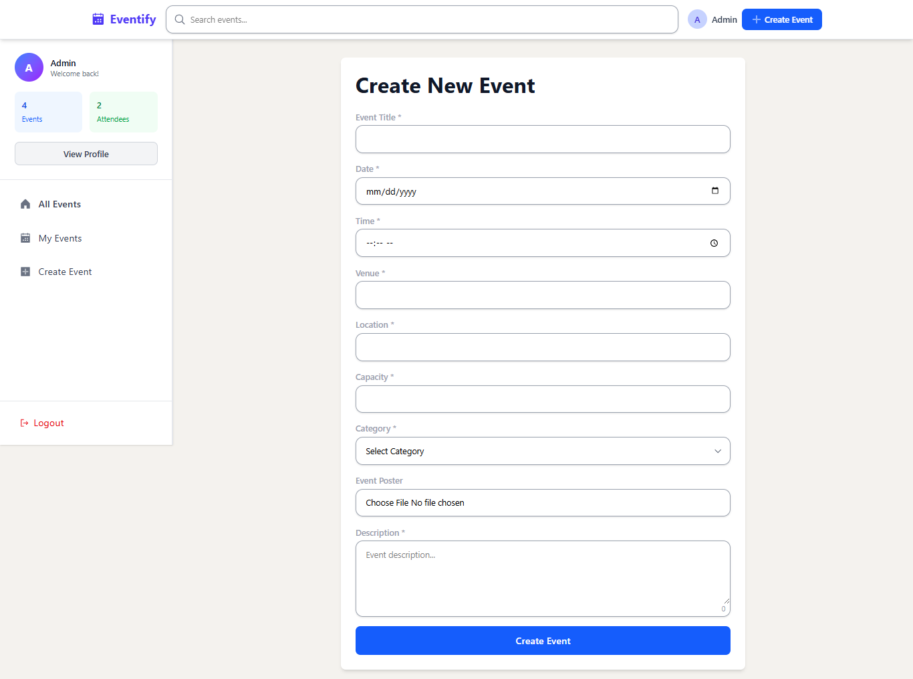

# Eventify - Modern Event Management Platform

Built in 3 days with industry best practices

Production-ready architecture with real-time capabilities

## Features

- **Real-time Updates**: RTK Query with automatic cache invalidation
- **Event Management**: Create, register, manage events
- **Admin Dashboard**: Attendee management & analytics
- **Search & Filter**: Category/location filtering
- **Responsive UI**: Mobile-first design with Tailwind

## Tech Stack

- **Frontend**: React 18 + JavaScript
- **State Management**: RTK Query (with real-time invalidation)
- **Styling**: TailwindCSS + Phosphor Icons
- **Architecture**: Atomic Design (Atoms, Molecules, Organisms)
- **Routing**: Dynamic + Protected routes with lazy loading

## Project Structure

```
src/
├── components/
│   ├── atoms/          # Basic UI elements
│   └── molecules/      # Compound components
├── pages/              # Route components
├── store/              # RTK Query + Slices
├── hooks/              # Custom hooks
└── utils/              # Helpers & services
```

## Key Technical Achievements

- **Real-time Registration**: RTK Query cache invalidation for live updates
- **Atomic Design**: Scalable component architecture
- **Performance**: Lazy loading + Dynamic imports
- **Security**: Protected routes implementation
- **UX**: Loading states + Smooth transitions

## Real-time Features

- Live attendee count updates
- Instant registration feedback
- Real-time dashboard updates

## What Makes This Special

Built with **enterprise-grade** practices:

- RTK Query's advanced caching strategy
- Scalable atomic design system
- Real-time data synchronization
- Industry-standard project structure

## Quick Start

** Frontend **

```bash
cd client
npm install
npm run dev
```

Make an env in client and place the url where Backend is running

** Backend **

```bash
cd mock backend
npm install
node start // or nodemon start (if installed)
```

## Screenshots


_Home page with search and event listings_


_Event creation form with image upload_


_Profile Page with event listing_


_Admin panel with attendee management_


_Fully responsive mobile interface, Event details with registration_

## Architecture Highlights

### Atomic Design System

Components are organized in atomic design pattern ensuring scalability and maintainability.

### RTK Query Real-time Strategy

Uses advanced cache invalidation techniques for real-time data updates without websockets.

### Performance Optimization

- Lazy loading for route components
- Code splitting for faster initial load
- Optimistic updates for better UX

### Security Features

- Protected routes implementation
- Authentication flow
- Role-based access control

Built with passion in 3 days | Production-ready architecture
